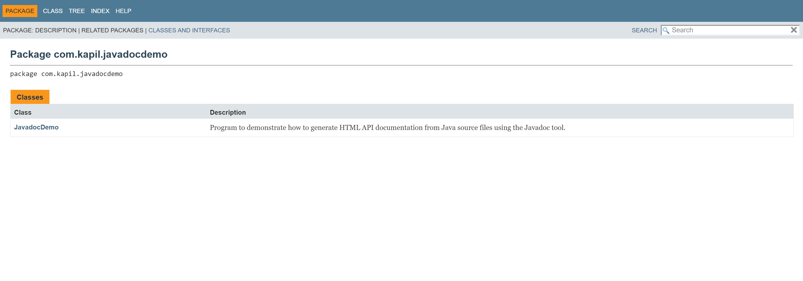
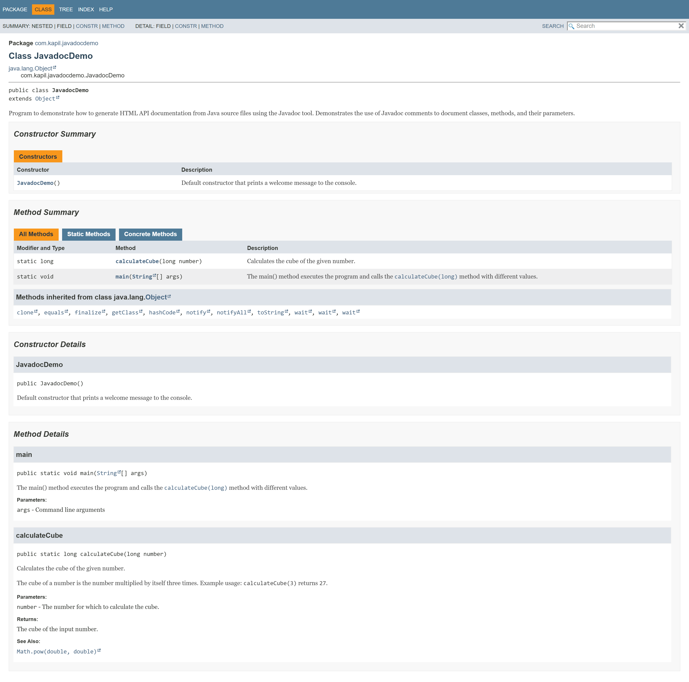

# 🚀 Javadoc-Demo
[](https://kappil-garg.github.io/javadoc-demo/)


This repository demonstrates how to generate HTML pages of API documentation from Java source files using the Javadoc tool.

---

## 🧪 Java Versions Support

Tested and compatible with the following Java versions:

- Java 7
- Java 8
- Java 11
- Java 17
- Java 21

✔️ No version-specific features used — works across all listed versions.

---

## 🧾 Topics Covered

- **Javadoc:** Learn how to use the Javadoc tool to generate detailed HTML documentation from Java source files.

---

## 💻️ Command to Generate Documentation via Javadoc Tool

- To generate documentation in the same folder as the source file:

```console
javadoc SourceFileName.java
```

- To generate documentation in a different folder:

```console
javadoc -d "Output Folder Path" SourceFileName.java
```

- For example, in this project, after navigating to the project root, the following command was executed:

```console
# Windows
javadoc -d "docs" src\com\kapil\javadocdemo\JavadocDemo.java

# macOS / Linux
javadoc -d docs src/com/kapil/javadocdemo/JavadocDemo.java
```

---

## 📸 Sample Output

- Here’s a preview of the generated documentation:


<p align="center"><em>Home page of the generated documentation.</em></p>


<p align="center"><em>Class-level documentation with constructor, method summary, and detailed descriptions.</em></p>

---

## 🗂️ Project Structure

```
Javadoc-Demo/
├── src/
│   └── com/kapil/javadocdemo/JavadocDemo.java
├── docs/
│   ├── index.html              # Generated Javadoc entry point
│   └── other Javadoc files
├── assets/                     # Sample Screenshots used in README
├── README.md
```
---

## 👓 How to View the Generated Documentation?

- The generated documentation files are located in the folder: <strong>docs/</strong>

- Open <strong>docs/index.html</strong> in any web browser to view the documentation.

---

## 🌐 GitHub Pages

This Javadoc documentation is hosted using **GitHub Pages** and can be viewed live here:

➡️ [https://kappil-garg.github.io/javadoc-demo/](https://kappil-garg.github.io/javadoc-demo/)

---

## 📖 Wiki

Looking for in-depth walkthrough or explanations?

Explore the [Project Wiki](https://github.com/kappil-garg/javadoc-demo/wiki) to learn more.

---

## ⚠️ Notes

- Ensure the Javadoc tool is installed and accessible via your system's PATH.

- Replace <strong>SourceFileName.java</strong> with the actual Java source file you want to document.

---

## 📚 Further Reading

- [Javadoc Tool Reference](https://docs.oracle.com/en/java/javase/21/docs/specs/man/javadoc.html)
- [Oracle’s Official Javadoc Guide](https://docs.oracle.com/en/java/javase/21/docs/specs/javadoc/doc-comment-spec.html)

---

## 📄 License

**MIT License** — free to use and modify.

---

### Tags

`#java` `#javadoc` `#javadoc-tool` `#github-pages` `#javadoc-visualization`

---
